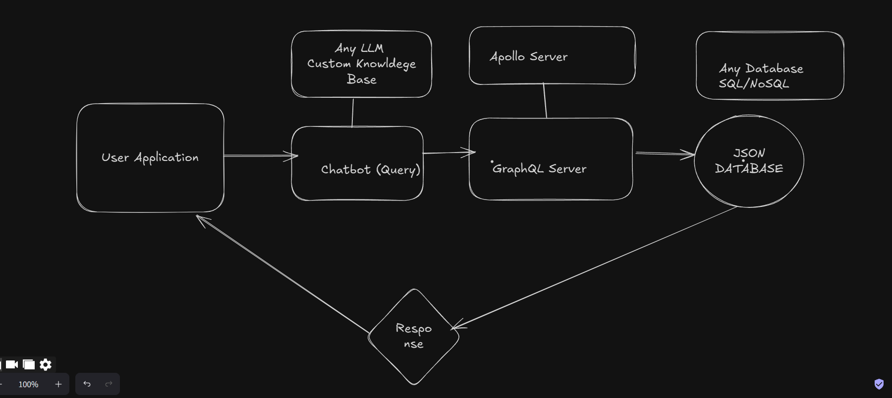
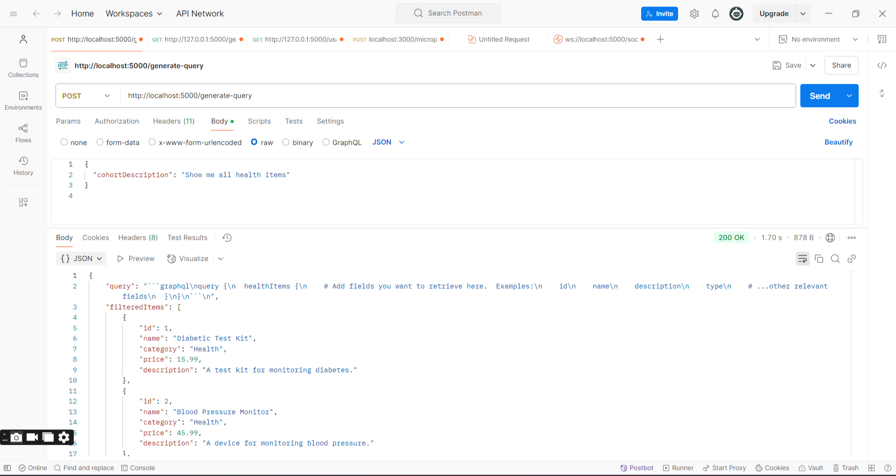

# AI Chatbot for support

Building a Chatbot for Generating GraphQL and Custom Queries for Cohort Descriptions . 

This project aims to develop a chatbot powered by ChatGPT or another large language model (LLM) that allows users to describe a cohort of patients and automatically generates GraphQL queries or custom queries based on the input for the PCDC. The goal is to simplify the process of building complex queries for patient data by allowing users to interact with the chatbot in natural language, rather than navigating through a UI or manually searching for filters.


## Architecture
This is the high level understanding .


## RESPONSE 
This is the resposne from the server . 



## Appendix

1. The sample data is created in items.json 
2. For this implementation i have tried to use GEMINI AI api key for generating the GRAPHQL queries . 

## 🚀 About Me
My name is Vivek Sharma ( 3rd year Undergraduate Student at National Institute of Technology Jamshedpur India) and i am currently a Lead Software Engineer at Ally and responsible for building Conversational AI Bots . 
I have previously worked with Sirocco Ventures (for Raggenie Project) as intern and was responsible for building multiple data source integrations and enabled Zitadel Authorization over entire 
application . Subsequently emerged as prime contributor for Raggenie . 

## Run Locally

Clone the project

```bash
  git clone https://github.com/uchiha-vivek/DataForCommonGoodBot.git
```

Go to the project directory

```bash
  cd DataForCommonGoodBot
```

Install dependencies

```bash
  npm install
```

Start the server

```bash
  npm run start
```


Make a .env file similar to .env-sample and place your LLM api key there (GEMINI) in my case .

